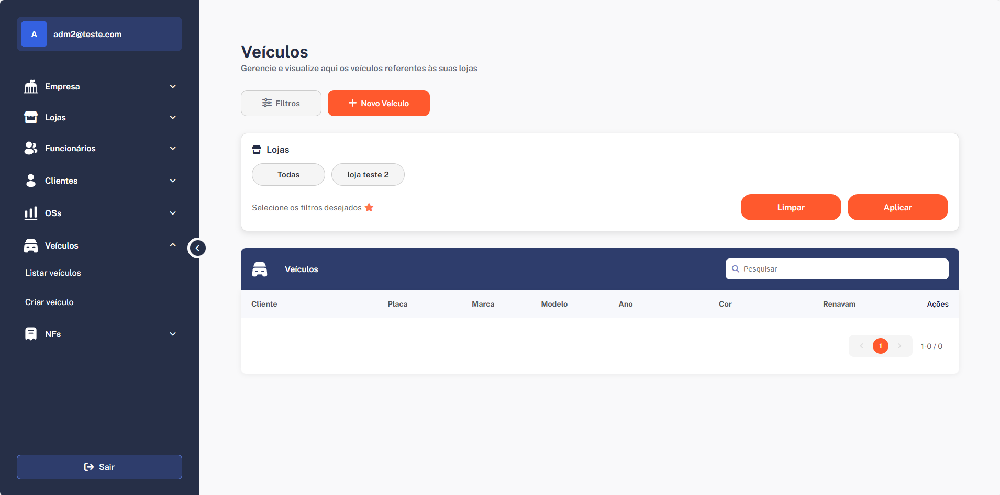

# MOTORCORE ERP - Frontend

Este projeto é uma ferramenta ERP desenvolvida para oficinas mecânicas e funilarias, com o objetivo de organizar processos internos de forma eficiente e automática.



## Funcionalidades Principais

- **Funcionalidades de autenticação:**
	- Login
	- Cadastro
	- Logout
	- Recuperação de senha
- **Edição de empresa**
- **Criação, edição e listagem de lojas da empresa, funcionários, clientes e veículos**
- **Vinculação de clientes e veículos às lojas**
- **Gestão de serviços e peças prestados para clientes e veículos nas OSs, com formatação automática das informações em PDF**
- **Tela de NFS para agrupar planilhas CSV por loja, facilitando a emissão de notas fiscais dos carros**
- **Limites de funcionalidades por plano**

## Tecnologias Utilizadas

- Angular
- TypeScript

## Como Executar

1. Instale as dependências:
	```bash
	npm install
	```
2. Inicie o projeto:
	```bash
	npm start
	```
3. Acesse no navegador:
	http://localhost:4200

